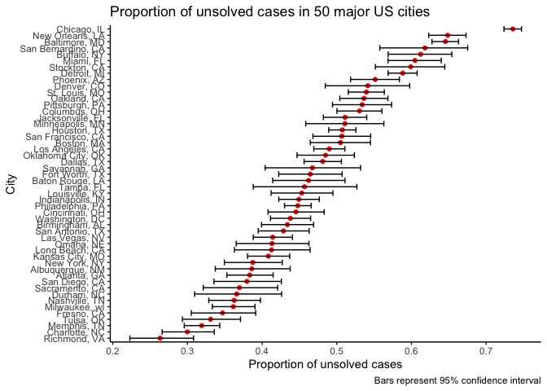

p8105_hw5_zq2209
================
Zining Qi
2022-11-14

``` r
library(tidyverse)
```

    ## ── Attaching packages ─────────────────────────────────────── tidyverse 1.3.2 ──
    ## ✔ ggplot2 3.3.6      ✔ purrr   0.3.4 
    ## ✔ tibble  3.1.8      ✔ dplyr   1.0.10
    ## ✔ tidyr   1.2.0      ✔ stringr 1.4.1 
    ## ✔ readr   2.1.2      ✔ forcats 0.5.2 
    ## ── Conflicts ────────────────────────────────────────── tidyverse_conflicts() ──
    ## ✖ dplyr::filter() masks stats::filter()
    ## ✖ dplyr::lag()    masks stats::lag()

# Problem 2

``` r
url = "https://raw.githubusercontent.com/washingtonpost/data-homicides/master/homicide-data.csv"
homicide = read_csv(url) %>% 
  janitor::clean_names()
```

    ## Rows: 52179 Columns: 12
    ## ── Column specification ────────────────────────────────────────────────────────
    ## Delimiter: ","
    ## chr (9): uid, victim_last, victim_first, victim_race, victim_age, victim_sex...
    ## dbl (3): reported_date, lat, lon
    ## 
    ## ℹ Use `spec()` to retrieve the full column specification for this data.
    ## ℹ Specify the column types or set `show_col_types = FALSE` to quiet this message.

``` r
summary(homicide)
```

    ##      uid            reported_date       victim_last        victim_first      
    ##  Length:52179       Min.   : 20070101   Length:52179       Length:52179      
    ##  Class :character   1st Qu.: 20100318   Class :character   Class :character  
    ##  Mode  :character   Median : 20121216   Mode  :character   Mode  :character  
    ##                     Mean   : 20130899                                        
    ##                     3rd Qu.: 20150911                                        
    ##                     Max.   :201511105                                        
    ##                                                                              
    ##  victim_race         victim_age         victim_sex            city          
    ##  Length:52179       Length:52179       Length:52179       Length:52179      
    ##  Class :character   Class :character   Class :character   Class :character  
    ##  Mode  :character   Mode  :character   Mode  :character   Mode  :character  
    ##                                                                             
    ##                                                                             
    ##                                                                             
    ##                                                                             
    ##     state                lat             lon          disposition       
    ##  Length:52179       Min.   :25.73   Min.   :-122.51   Length:52179      
    ##  Class :character   1st Qu.:33.77   1st Qu.: -96.00   Class :character  
    ##  Mode  :character   Median :38.52   Median : -87.71   Mode  :character  
    ##                     Mean   :37.03   Mean   : -91.47                     
    ##                     3rd Qu.:40.03   3rd Qu.: -81.76                     
    ##                     Max.   :45.05   Max.   : -71.01                     
    ##                     NA's   :60      NA's   :60

``` r
homicide$city_state = paste(homicide$city, homicide$state, sep = ', ')
```

``` r
total_homicides_cities = homicide %>% 
  group_by(city_state) %>% 
  summarize(total = n())
```

``` r
total_unsolved_homicides = homicide %>% 
  filter(disposition == 'Closed without arrest' | disposition == 'Open/No arrest') %>% 
  group_by(city_state) %>% 
  summarize(unsolved = n())
```

``` r
total_homicides = left_join(total_homicides_cities, total_unsolved_homicides, by = "city_state")
total_homicides
```

    ## # A tibble: 51 × 3
    ##    city_state      total unsolved
    ##    <chr>           <int>    <int>
    ##  1 Albuquerque, NM   378      146
    ##  2 Atlanta, GA       973      373
    ##  3 Baltimore, MD    2827     1825
    ##  4 Baton Rouge, LA   424      196
    ##  5 Birmingham, AL    800      347
    ##  6 Boston, MA        614      310
    ##  7 Buffalo, NY       521      319
    ##  8 Charlotte, NC     687      206
    ##  9 Chicago, IL      5535     4073
    ## 10 Cincinnati, OH    694      309
    ## # … with 41 more rows

``` r
total_homicides_baltimore = total_homicides %>% 
  filter(city_state == "Baltimore, MD")
prop.test_baltimore = prop.test(total_homicides_baltimore$unsolved, total_homicides_baltimore$total)
```

``` r
prop_test = function(df) {
  ci_unsolved <- prop.test(df$unsolved, df$total)
  broom::tidy(ci_unsolved) %>% 
    select(estimate, conf.low, conf.high)
}
```

``` r
prop_test_baltimore = total_homicides %>% 
  filter(city_state == "Baltimore, MD") %>% 
  prop_test() %>% 
  rename("Estimate of proportion" = estimate, 
         "Lower bound" = conf.low, 
         "Upper bound" = conf.high) %>% 
  knitr::kable()
```

``` r
city_nest = nest(total_homicides, unsolved:total)
```

    ## Warning: All elements of `...` must be named.
    ## Did you want `data = unsolved:total`?

``` r
city_nest$data[[1]]
```

    ## # A tibble: 1 × 2
    ##   unsolved total
    ##      <int> <int>
    ## 1      146   378

``` r
prop_test_all = city_nest[-49,] %>% 
  mutate(prop_unsolved = map(data, prop_test)) %>% 
  unnest() %>% 
  rename('Estimate of proportion' = estimate, 
         "Lower bound" = conf.low, 
         "Upper bound" = conf.high) %>% 
  knitr::kable()
```

    ## Warning: `cols` is now required when using unnest().
    ## Please use `cols = c(data, prop_unsolved)`

``` r
prop_test_all
```

| city_state         | unsolved | total | Estimate of proportion | Lower bound | Upper bound |
|:-------------------|---------:|------:|-----------------------:|------------:|------------:|
| Albuquerque, NM    |      146 |   378 |              0.3862434 |   0.3372604 |   0.4375766 |
| Atlanta, GA        |      373 |   973 |              0.3833505 |   0.3528119 |   0.4148219 |
| Baltimore, MD      |     1825 |  2827 |              0.6455607 |   0.6275625 |   0.6631599 |
| Baton Rouge, LA    |      196 |   424 |              0.4622642 |   0.4141987 |   0.5110240 |
| Birmingham, AL     |      347 |   800 |              0.4337500 |   0.3991889 |   0.4689557 |
| Boston, MA         |      310 |   614 |              0.5048860 |   0.4646219 |   0.5450881 |
| Buffalo, NY        |      319 |   521 |              0.6122841 |   0.5687990 |   0.6540879 |
| Charlotte, NC      |      206 |   687 |              0.2998544 |   0.2660820 |   0.3358999 |
| Chicago, IL        |     4073 |  5535 |              0.7358627 |   0.7239959 |   0.7473998 |
| Cincinnati, OH     |      309 |   694 |              0.4452450 |   0.4079606 |   0.4831439 |
| Columbus, OH       |      575 |  1084 |              0.5304428 |   0.5002167 |   0.5604506 |
| Dallas, TX         |      754 |  1567 |              0.4811742 |   0.4561942 |   0.5062475 |
| Denver, CO         |      169 |   312 |              0.5416667 |   0.4846098 |   0.5976807 |
| Detroit, MI        |     1482 |  2519 |              0.5883287 |   0.5687903 |   0.6075953 |
| Durham, NC         |      101 |   276 |              0.3659420 |   0.3095874 |   0.4260936 |
| Fort Worth, TX     |      255 |   549 |              0.4644809 |   0.4222542 |   0.5072119 |
| Fresno, CA         |      169 |   487 |              0.3470226 |   0.3051013 |   0.3913963 |
| Houston, TX        |     1493 |  2942 |              0.5074779 |   0.4892447 |   0.5256914 |
| Indianapolis, IN   |      594 |  1322 |              0.4493192 |   0.4223156 |   0.4766207 |
| Jacksonville, FL   |      597 |  1168 |              0.5111301 |   0.4820460 |   0.5401402 |
| Kansas City, MO    |      486 |  1190 |              0.4084034 |   0.3803996 |   0.4370054 |
| Las Vegas, NV      |      572 |  1381 |              0.4141926 |   0.3881284 |   0.4407395 |
| Long Beach, CA     |      156 |   378 |              0.4126984 |   0.3629026 |   0.4642973 |
| Los Angeles, CA    |     1106 |  2257 |              0.4900310 |   0.4692208 |   0.5108754 |
| Louisville, KY     |      261 |   576 |              0.4531250 |   0.4120609 |   0.4948235 |
| Memphis, TN        |      483 |  1514 |              0.3190225 |   0.2957047 |   0.3432691 |
| Miami, FL          |      450 |   744 |              0.6048387 |   0.5685783 |   0.6400015 |
| Milwaukee, wI      |      403 |  1115 |              0.3614350 |   0.3333172 |   0.3905194 |
| Minneapolis, MN    |      187 |   366 |              0.5109290 |   0.4585150 |   0.5631099 |
| Nashville, TN      |      278 |   767 |              0.3624511 |   0.3285592 |   0.3977401 |
| New Orleans, LA    |      930 |  1434 |              0.6485356 |   0.6231048 |   0.6731615 |
| New York, NY       |      243 |   627 |              0.3875598 |   0.3494421 |   0.4270755 |
| Oakland, CA        |      508 |   947 |              0.5364308 |   0.5040588 |   0.5685037 |
| Oklahoma City, OK  |      326 |   672 |              0.4851190 |   0.4467861 |   0.5236245 |
| Omaha, NE          |      169 |   409 |              0.4132029 |   0.3653146 |   0.4627477 |
| Philadelphia, PA   |     1360 |  3037 |              0.4478103 |   0.4300380 |   0.4657157 |
| Phoenix, AZ        |      504 |   914 |              0.5514223 |   0.5184825 |   0.5839244 |
| Pittsburgh, PA     |      337 |   631 |              0.5340729 |   0.4942706 |   0.5734545 |
| Richmond, VA       |      113 |   429 |              0.2634033 |   0.2228571 |   0.3082658 |
| Sacramento, CA     |      139 |   376 |              0.3696809 |   0.3211559 |   0.4209131 |
| San Antonio, TX    |      357 |   833 |              0.4285714 |   0.3947772 |   0.4630331 |
| San Bernardino, CA |      170 |   275 |              0.6181818 |   0.5576628 |   0.6753422 |
| San Diego, CA      |      175 |   461 |              0.3796095 |   0.3354259 |   0.4258315 |
| San Francisco, CA  |      336 |   663 |              0.5067873 |   0.4680516 |   0.5454433 |
| Savannah, GA       |      115 |   246 |              0.4674797 |   0.4041252 |   0.5318665 |
| St. Louis, MO      |      905 |  1677 |              0.5396541 |   0.5154369 |   0.5636879 |
| Stockton, CA       |      266 |   444 |              0.5990991 |   0.5517145 |   0.6447418 |
| Tampa, FL          |       95 |   208 |              0.4567308 |   0.3881009 |   0.5269851 |
| Tulsa, OK          |      193 |   583 |              0.3310463 |   0.2932349 |   0.3711192 |
| Washington, DC     |      589 |  1345 |              0.4379182 |   0.4112495 |   0.4649455 |

``` r
prop_ci_all = city_nest[-49,] %>% 
  mutate(prop_unsolved = map(data, prop_test)) %>% 
  unnest()
```

    ## Warning: `cols` is now required when using unnest().
    ## Please use `cols = c(data, prop_unsolved)`

``` r
prop_ci_all %>% 
  mutate(city_state = fct_reorder(city_state, estimate)) %>% 
  ggplot(aes(x = city_state, y = estimate)) + 
  geom_point(color = "red") + 
  geom_errorbar(aes(ymin = conf.low, ymax = conf.high)) + 
  coord_flip() + 
  labs(title = "Proportion of unsolved cases in 50 major US cities", 
       y = "Proportion of unsolved cases", 
       x = "City", 
       caption = "Bars represent 95% confidence interval") + 
  theme_classic() 
```

<!-- -->
