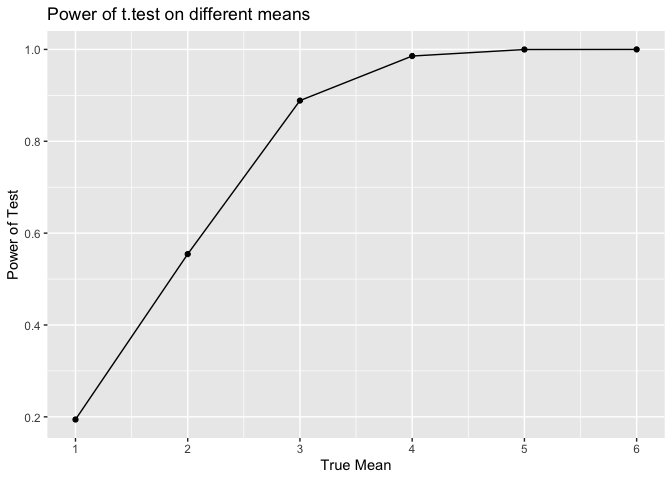
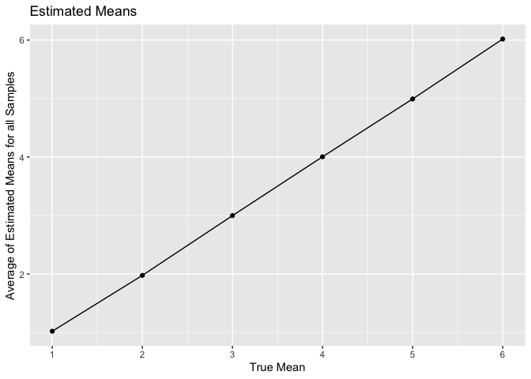
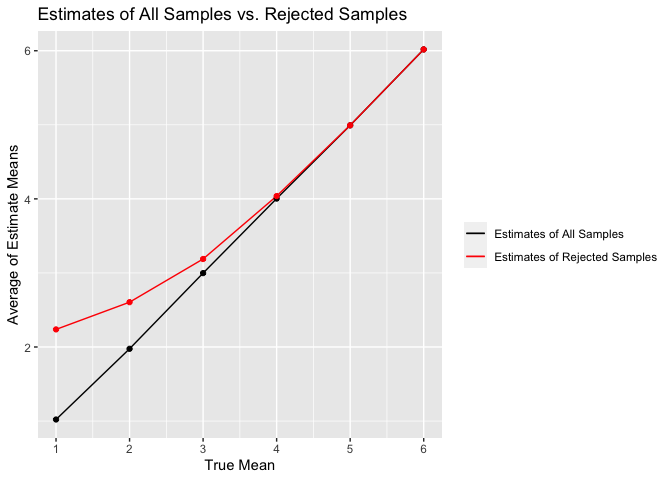

p8105_hw5_zq2209
================
Zining Qi
2022-11-14

``` r
library(tidyverse)
```

    ## ── Attaching packages ─────────────────────────────────────── tidyverse 1.3.2 ──
    ## ✔ ggplot2 3.3.6      ✔ purrr   0.3.4 
    ## ✔ tibble  3.1.8      ✔ dplyr   1.0.10
    ## ✔ tidyr   1.2.0      ✔ stringr 1.4.1 
    ## ✔ readr   2.1.2      ✔ forcats 0.5.2 
    ## ── Conflicts ────────────────────────────────────────── tidyverse_conflicts() ──
    ## ✖ dplyr::filter() masks stats::filter()
    ## ✖ dplyr::lag()    masks stats::lag()

# Problem 2

``` r
url = "https://raw.githubusercontent.com/washingtonpost/data-homicides/master/homicide-data.csv"
homicide = read_csv(url) %>% 
  janitor::clean_names()
```

    ## Rows: 52179 Columns: 12
    ## ── Column specification ────────────────────────────────────────────────────────
    ## Delimiter: ","
    ## chr (9): uid, victim_last, victim_first, victim_race, victim_age, victim_sex...
    ## dbl (3): reported_date, lat, lon
    ## 
    ## ℹ Use `spec()` to retrieve the full column specification for this data.
    ## ℹ Specify the column types or set `show_col_types = FALSE` to quiet this message.

## Desctibe raw data

``` r
summary(homicide)
```

    ##      uid            reported_date       victim_last        victim_first      
    ##  Length:52179       Min.   : 20070101   Length:52179       Length:52179      
    ##  Class :character   1st Qu.: 20100318   Class :character   Class :character  
    ##  Mode  :character   Median : 20121216   Mode  :character   Mode  :character  
    ##                     Mean   : 20130899                                        
    ##                     3rd Qu.: 20150911                                        
    ##                     Max.   :201511105                                        
    ##                                                                              
    ##  victim_race         victim_age         victim_sex            city          
    ##  Length:52179       Length:52179       Length:52179       Length:52179      
    ##  Class :character   Class :character   Class :character   Class :character  
    ##  Mode  :character   Mode  :character   Mode  :character   Mode  :character  
    ##                                                                             
    ##                                                                             
    ##                                                                             
    ##                                                                             
    ##     state                lat             lon          disposition       
    ##  Length:52179       Min.   :25.73   Min.   :-122.51   Length:52179      
    ##  Class :character   1st Qu.:33.77   1st Qu.: -96.00   Class :character  
    ##  Mode  :character   Median :38.52   Median : -87.71   Mode  :character  
    ##                     Mean   :37.03   Mean   : -91.47                     
    ##                     3rd Qu.:40.03   3rd Qu.: -81.76                     
    ##                     Max.   :45.05   Max.   : -71.01                     
    ##                     NA's   :60      NA's   :60

``` r
dim(homicide)
```

    ## [1] 52179    12

There are 52179 rows and 12 columns in the dataset. The columns are uni,
reported_date(the day of victim reported), victim_last(last name of
victim), victim_first(first name), victim race, victim age, victim sex,
city, state, latitude, longitude, and disposition.

## Create a `city_state` variable

``` r
homicide$city_state = paste(homicide$city, homicide$state, sep = ', ')
homicide %>%
  head() %>% 
  knitr::kable()
```

| uid        | reported_date | victim_last | victim_first | victim_race | victim_age | victim_sex | city        | state |      lat |       lon | disposition           | city_state      |
|:-----------|--------------:|:------------|:-------------|:------------|:-----------|:-----------|:------------|:------|---------:|----------:|:----------------------|:----------------|
| Alb-000001 |      20100504 | GARCIA      | JUAN         | Hispanic    | 78         | Male       | Albuquerque | NM    | 35.09579 | -106.5386 | Closed without arrest | Albuquerque, NM |
| Alb-000002 |      20100216 | MONTOYA     | CAMERON      | Hispanic    | 17         | Male       | Albuquerque | NM    | 35.05681 | -106.7153 | Closed by arrest      | Albuquerque, NM |
| Alb-000003 |      20100601 | SATTERFIELD | VIVIANA      | White       | 15         | Female     | Albuquerque | NM    | 35.08609 | -106.6956 | Closed without arrest | Albuquerque, NM |
| Alb-000004 |      20100101 | MENDIOLA    | CARLOS       | Hispanic    | 32         | Male       | Albuquerque | NM    | 35.07849 | -106.5561 | Closed by arrest      | Albuquerque, NM |
| Alb-000005 |      20100102 | MULA        | VIVIAN       | White       | 72         | Female     | Albuquerque | NM    | 35.13036 | -106.5810 | Closed without arrest | Albuquerque, NM |
| Alb-000006 |      20100126 | BOOK        | GERALDINE    | White       | 91         | Female     | Albuquerque | NM    | 35.15111 | -106.5378 | Open/No arrest        | Albuquerque, NM |

## Total number of homicides within cities

``` r
total_homicides_cities = homicide %>% 
  group_by(city_state) %>% 
  summarize(total = n()) %>% 
  arrange(desc(total)) %>% 
  knitr::kable()
total_homicides_cities
```

| city_state         | total |
|:-------------------|------:|
| Chicago, IL        |  5535 |
| Philadelphia, PA   |  3037 |
| Houston, TX        |  2942 |
| Baltimore, MD      |  2827 |
| Detroit, MI        |  2519 |
| Los Angeles, CA    |  2257 |
| St. Louis, MO      |  1677 |
| Dallas, TX         |  1567 |
| Memphis, TN        |  1514 |
| New Orleans, LA    |  1434 |
| Las Vegas, NV      |  1381 |
| Washington, DC     |  1345 |
| Indianapolis, IN   |  1322 |
| Kansas City, MO    |  1190 |
| Jacksonville, FL   |  1168 |
| Milwaukee, wI      |  1115 |
| Columbus, OH       |  1084 |
| Atlanta, GA        |   973 |
| Oakland, CA        |   947 |
| Phoenix, AZ        |   914 |
| San Antonio, TX    |   833 |
| Birmingham, AL     |   800 |
| Nashville, TN      |   767 |
| Miami, FL          |   744 |
| Cincinnati, OH     |   694 |
| Charlotte, NC      |   687 |
| Oklahoma City, OK  |   672 |
| San Francisco, CA  |   663 |
| Pittsburgh, PA     |   631 |
| New York, NY       |   627 |
| Boston, MA         |   614 |
| Tulsa, OK          |   583 |
| Louisville, KY     |   576 |
| Fort Worth, TX     |   549 |
| Buffalo, NY        |   521 |
| Fresno, CA         |   487 |
| San Diego, CA      |   461 |
| Stockton, CA       |   444 |
| Richmond, VA       |   429 |
| Baton Rouge, LA    |   424 |
| Omaha, NE          |   409 |
| Albuquerque, NM    |   378 |
| Long Beach, CA     |   378 |
| Sacramento, CA     |   376 |
| Minneapolis, MN    |   366 |
| Denver, CO         |   312 |
| Durham, NC         |   276 |
| San Bernardino, CA |   275 |
| Savannah, GA       |   246 |
| Tampa, FL          |   208 |
| Tulsa, AL          |     1 |

## Total number of unsolved homicides withinn cities

``` r
total_unsolved_homicides = homicide %>% 
  filter(disposition == 'Closed without arrest' | disposition == 'Open/No arrest') %>% 
  group_by(city_state) %>% 
  summarize(unsolved = n()) %>% 
  arrange(desc(unsolved)) %>% 
  knitr::kable()
total_unsolved_homicides
```

| city_state         | unsolved |
|:-------------------|---------:|
| Chicago, IL        |     4073 |
| Baltimore, MD      |     1825 |
| Houston, TX        |     1493 |
| Detroit, MI        |     1482 |
| Philadelphia, PA   |     1360 |
| Los Angeles, CA    |     1106 |
| New Orleans, LA    |      930 |
| St. Louis, MO      |      905 |
| Dallas, TX         |      754 |
| Jacksonville, FL   |      597 |
| Indianapolis, IN   |      594 |
| Washington, DC     |      589 |
| Columbus, OH       |      575 |
| Las Vegas, NV      |      572 |
| Oakland, CA        |      508 |
| Phoenix, AZ        |      504 |
| Kansas City, MO    |      486 |
| Memphis, TN        |      483 |
| Miami, FL          |      450 |
| Milwaukee, wI      |      403 |
| Atlanta, GA        |      373 |
| San Antonio, TX    |      357 |
| Birmingham, AL     |      347 |
| Pittsburgh, PA     |      337 |
| San Francisco, CA  |      336 |
| Oklahoma City, OK  |      326 |
| Buffalo, NY        |      319 |
| Boston, MA         |      310 |
| Cincinnati, OH     |      309 |
| Nashville, TN      |      278 |
| Stockton, CA       |      266 |
| Louisville, KY     |      261 |
| Fort Worth, TX     |      255 |
| New York, NY       |      243 |
| Charlotte, NC      |      206 |
| Baton Rouge, LA    |      196 |
| Tulsa, OK          |      193 |
| Minneapolis, MN    |      187 |
| San Diego, CA      |      175 |
| San Bernardino, CA |      170 |
| Denver, CO         |      169 |
| Fresno, CA         |      169 |
| Omaha, NE          |      169 |
| Long Beach, CA     |      156 |
| Albuquerque, NM    |      146 |
| Sacramento, CA     |      139 |
| Savannah, GA       |      115 |
| Richmond, VA       |      113 |
| Durham, NC         |      101 |
| Tampa, FL          |       95 |

## Total number of all and unsolved homicides withinn cities

``` r
total_homicides_table = homicide %>% 
  group_by(city_state) %>% 
  summarize(
    total = n(),
    unsolved = sum(disposition == "Open/No arrest") + sum(disposition == "Closed without arrest")) %>% 
  arrange(desc(total)) %>% 
  knitr::kable()
total_homicides_table
```

| city_state         | total | unsolved |
|:-------------------|------:|---------:|
| Chicago, IL        |  5535 |     4073 |
| Philadelphia, PA   |  3037 |     1360 |
| Houston, TX        |  2942 |     1493 |
| Baltimore, MD      |  2827 |     1825 |
| Detroit, MI        |  2519 |     1482 |
| Los Angeles, CA    |  2257 |     1106 |
| St. Louis, MO      |  1677 |      905 |
| Dallas, TX         |  1567 |      754 |
| Memphis, TN        |  1514 |      483 |
| New Orleans, LA    |  1434 |      930 |
| Las Vegas, NV      |  1381 |      572 |
| Washington, DC     |  1345 |      589 |
| Indianapolis, IN   |  1322 |      594 |
| Kansas City, MO    |  1190 |      486 |
| Jacksonville, FL   |  1168 |      597 |
| Milwaukee, wI      |  1115 |      403 |
| Columbus, OH       |  1084 |      575 |
| Atlanta, GA        |   973 |      373 |
| Oakland, CA        |   947 |      508 |
| Phoenix, AZ        |   914 |      504 |
| San Antonio, TX    |   833 |      357 |
| Birmingham, AL     |   800 |      347 |
| Nashville, TN      |   767 |      278 |
| Miami, FL          |   744 |      450 |
| Cincinnati, OH     |   694 |      309 |
| Charlotte, NC      |   687 |      206 |
| Oklahoma City, OK  |   672 |      326 |
| San Francisco, CA  |   663 |      336 |
| Pittsburgh, PA     |   631 |      337 |
| New York, NY       |   627 |      243 |
| Boston, MA         |   614 |      310 |
| Tulsa, OK          |   583 |      193 |
| Louisville, KY     |   576 |      261 |
| Fort Worth, TX     |   549 |      255 |
| Buffalo, NY        |   521 |      319 |
| Fresno, CA         |   487 |      169 |
| San Diego, CA      |   461 |      175 |
| Stockton, CA       |   444 |      266 |
| Richmond, VA       |   429 |      113 |
| Baton Rouge, LA    |   424 |      196 |
| Omaha, NE          |   409 |      169 |
| Albuquerque, NM    |   378 |      146 |
| Long Beach, CA     |   378 |      156 |
| Sacramento, CA     |   376 |      139 |
| Minneapolis, MN    |   366 |      187 |
| Denver, CO         |   312 |      169 |
| Durham, NC         |   276 |      101 |
| San Bernardino, CA |   275 |      170 |
| Savannah, GA       |   246 |      115 |
| Tampa, FL          |   208 |       95 |
| Tulsa, AL          |     1 |        0 |

## `prop.test` for Baltimore, MD

``` r
total_homicides = homicide %>% 
  group_by(city_state) %>% 
  summarize(
    total = n(),
    unsolved = sum(disposition == "Open/No arrest") + sum(disposition == "Closed without arrest")) %>% 
  arrange(desc(total))
```

``` r
total_homicides_baltimore = total_homicides %>% 
  filter(city_state == "Baltimore, MD")
prop.test_baltimore = prop.test(total_homicides_baltimore$unsolved, total_homicides_baltimore$total)
prop.test_baltimore
```

    ## 
    ##  1-sample proportions test with continuity correction
    ## 
    ## data:  total_homicides_baltimore$unsolved out of total_homicides_baltimore$total, null probability 0.5
    ## X-squared = 239.01, df = 1, p-value < 2.2e-16
    ## alternative hypothesis: true p is not equal to 0.5
    ## 95 percent confidence interval:
    ##  0.6275625 0.6631599
    ## sample estimates:
    ##         p 
    ## 0.6455607

### Save result as .RData

``` r
save(prop.test_baltimore, file = "result/prop_test_baltimore_result.RData")
```

### Table of `prop.test` result

``` r
prop_test_baltimore = prop.test_baltimore %>% 
  broom::tidy() %>% 
  select(estimate,conf.low,conf.high) %>% 
  rename("Estimate of proportion" = estimate, 
         "Lower bound" = conf.low, 
         "Upper bound" = conf.high) %>% 
  knitr::kable()
prop_test_baltimore
```

| Estimate of proportion | Lower bound | Upper bound |
|-----------------------:|------------:|------------:|
|              0.6455607 |   0.6275625 |   0.6631599 |

## Writing a function

``` r
prop_unsolved_all = function(citystate){
  city_df = homicide %>% 
    filter(city_state == citystate) %>% 
    nrow()
  
  unsolved = homicide %>% 
    filter(city_state == citystate) %>%
    filter(disposition == 'Closed without arrest' | disposition == 'Open/No arrest') %>% 
    nrow()
  
    result = prop.test(unsolved, city_df) %>% 
    broom::tidy() %>% 
    select(estimate, conf.low, conf.high)
    
    result
}
```

## Loop the function over all 50 cities

``` r
city_state_list = homicide %>% 
  select(city_state) %>% 
  unique()
```

``` r
prop_test_all = city_state_list %>% 
  mutate(prop_result = map(city_state, prop_unsolved_all)) %>% 
  unnest(prop_result) %>% 
  arrange(desc(estimate))
```

    ## Warning in prop.test(unsolved, city_df): Chi-squared approximation may be
    ## incorrect

### Table of `prop.test` result

``` r
prop_test_all_table = prop_test_all %>% 
  rename('Estimate of proportion' = estimate, 
         "Lower bound" = conf.low, 
         "Upper bound" = conf.high) %>% 
  knitr::kable()
prop_test_all_table
```

| city_state         | Estimate of proportion | Lower bound | Upper bound |
|:-------------------|-----------------------:|------------:|------------:|
| Chicago, IL        |              0.7358627 |   0.7239959 |   0.7473998 |
| New Orleans, LA    |              0.6485356 |   0.6231048 |   0.6731615 |
| Baltimore, MD      |              0.6455607 |   0.6275625 |   0.6631599 |
| San Bernardino, CA |              0.6181818 |   0.5576628 |   0.6753422 |
| Buffalo, NY        |              0.6122841 |   0.5687990 |   0.6540879 |
| Miami, FL          |              0.6048387 |   0.5685783 |   0.6400015 |
| Stockton, CA       |              0.5990991 |   0.5517145 |   0.6447418 |
| Detroit, MI        |              0.5883287 |   0.5687903 |   0.6075953 |
| Phoenix, AZ        |              0.5514223 |   0.5184825 |   0.5839244 |
| Denver, CO         |              0.5416667 |   0.4846098 |   0.5976807 |
| St. Louis, MO      |              0.5396541 |   0.5154369 |   0.5636879 |
| Oakland, CA        |              0.5364308 |   0.5040588 |   0.5685037 |
| Pittsburgh, PA     |              0.5340729 |   0.4942706 |   0.5734545 |
| Columbus, OH       |              0.5304428 |   0.5002167 |   0.5604506 |
| Jacksonville, FL   |              0.5111301 |   0.4820460 |   0.5401402 |
| Minneapolis, MN    |              0.5109290 |   0.4585150 |   0.5631099 |
| Houston, TX        |              0.5074779 |   0.4892447 |   0.5256914 |
| San Francisco, CA  |              0.5067873 |   0.4680516 |   0.5454433 |
| Boston, MA         |              0.5048860 |   0.4646219 |   0.5450881 |
| Los Angeles, CA    |              0.4900310 |   0.4692208 |   0.5108754 |
| Oklahoma City, OK  |              0.4851190 |   0.4467861 |   0.5236245 |
| Dallas, TX         |              0.4811742 |   0.4561942 |   0.5062475 |
| Savannah, GA       |              0.4674797 |   0.4041252 |   0.5318665 |
| Fort Worth, TX     |              0.4644809 |   0.4222542 |   0.5072119 |
| Baton Rouge, LA    |              0.4622642 |   0.4141987 |   0.5110240 |
| Tampa, FL          |              0.4567308 |   0.3881009 |   0.5269851 |
| Louisville, KY     |              0.4531250 |   0.4120609 |   0.4948235 |
| Indianapolis, IN   |              0.4493192 |   0.4223156 |   0.4766207 |
| Philadelphia, PA   |              0.4478103 |   0.4300380 |   0.4657157 |
| Cincinnati, OH     |              0.4452450 |   0.4079606 |   0.4831439 |
| Washington, DC     |              0.4379182 |   0.4112495 |   0.4649455 |
| Birmingham, AL     |              0.4337500 |   0.3991889 |   0.4689557 |
| San Antonio, TX    |              0.4285714 |   0.3947772 |   0.4630331 |
| Las Vegas, NV      |              0.4141926 |   0.3881284 |   0.4407395 |
| Omaha, NE          |              0.4132029 |   0.3653146 |   0.4627477 |
| Long Beach, CA     |              0.4126984 |   0.3629026 |   0.4642973 |
| Kansas City, MO    |              0.4084034 |   0.3803996 |   0.4370054 |
| New York, NY       |              0.3875598 |   0.3494421 |   0.4270755 |
| Albuquerque, NM    |              0.3862434 |   0.3372604 |   0.4375766 |
| Atlanta, GA        |              0.3833505 |   0.3528119 |   0.4148219 |
| San Diego, CA      |              0.3796095 |   0.3354259 |   0.4258315 |
| Sacramento, CA     |              0.3696809 |   0.3211559 |   0.4209131 |
| Durham, NC         |              0.3659420 |   0.3095874 |   0.4260936 |
| Nashville, TN      |              0.3624511 |   0.3285592 |   0.3977401 |
| Milwaukee, wI      |              0.3614350 |   0.3333172 |   0.3905194 |
| Fresno, CA         |              0.3470226 |   0.3051013 |   0.3913963 |
| Tulsa, OK          |              0.3310463 |   0.2932349 |   0.3711192 |
| Memphis, TN        |              0.3190225 |   0.2957047 |   0.3432691 |
| Charlotte, NC      |              0.2998544 |   0.2660820 |   0.3358999 |
| Richmond, VA       |              0.2634033 |   0.2228571 |   0.3082658 |
| Tulsa, AL          |              0.0000000 |   0.0000000 |   0.9453792 |

### Plot of `prop.test` result

``` r
prop_test_all %>% 
  mutate(city_state = fct_reorder(city_state, estimate)) %>% 
  ggplot(aes(x = city_state, y = estimate)) + 
  geom_point(color = "red") + 
  geom_errorbar(aes(ymin = conf.low, ymax = conf.high)) + 
  coord_flip() + 
  labs(title = "Proportion of unsolved cases in 50 major US cities", 
       y = "Proportion of unsolved cases", 
       x = "City, State", 
       caption = "Bars represent 95% confidence interval") + 
  theme_classic() 
```

<!-- -->

# Problem 3

## Generate 5000 datasets for mu = 0

``` r
datasets = map(1:5000, ~ rnorm(n = 30, mean = 0, sd = 5))
```

## Writing a function

``` r
t_test = function(mu) {
  data = c(rnorm(n = 30, mean = mu, sd = 5))
  
  result = t.test(data, mu = mu) %>% 
    broom::tidy() %>% 
    select(estimate,p.value)
  
  result
}
```

## Loop over 5000 datasets for mu = 0

``` r
iteration = 1:5000
mu0_df = tibble(iteration)
mu0_df$mean = 0
t_test_mu0 = mu0_df %>%
  mutate(result = map(mean,t_test)) %>% 
  unnest(result)
head(t_test_mu0)
```

    ## # A tibble: 6 × 4
    ##   iteration  mean estimate p.value
    ##       <int> <dbl>    <dbl>   <dbl>
    ## 1         1     0  -1.39    0.105 
    ## 2         2     0  -2.01    0.0261
    ## 3         3     0   0.0542  0.959 
    ## 4         4     0   0.0982  0.923 
    ## 5         5     0  -0.295   0.786 
    ## 6         6     0   0.422   0.663

## Loop over 5000 datasets for mu = 1-6

``` r
mu_df = expand_grid(mean = 1:6, iteration = 1:5000)
t_test_all <- mu_df %>% 
  mutate(result = map(mean,t_test)) %>% 
  unnest(result)

head(t_test_all)
```

    ## # A tibble: 6 × 4
    ##    mean iteration estimate p.value
    ##   <int>     <int>    <dbl>   <dbl>
    ## 1     1         1   -0.125  0.245 
    ## 2     1         2    1.59   0.516 
    ## 3     1         3    0.958  0.954 
    ## 4     1         4    0.804  0.860 
    ## 5     1         5    2.79   0.0756
    ## 6     1         6    1.41   0.635

## Plot showing the power of the test on the y axis and the true value of mean on the x axis

``` r
power_test = t_test_all %>%
  filter(p.value < 0.05) %>% 
  group_by(mean) %>% 
  count() %>% 
  mutate(reject_prop = n/5000) %>% 
  ggplot(aes(x = mean,y = reject_prop)) +
  scale_x_continuous(limits = c(1,6), breaks = seq(1,6,1)) + 
  geom_point() + geom_path() +
  labs(x = "True Mean",y = "Power of Test",title = "Power of t.test on different means")
power_test
```

<!-- -->

``` r
power_test_table = t_test_all %>%
  filter(p.value < 0.05) %>% 
  group_by(mean) %>% 
  count() %>% 
  mutate(reject_prop = n/5000) %>% 
  knitr::kable()
power_test_table
```

| mean |   n | reject_prop |
|-----:|----:|------------:|
|    1 | 252 |      0.0504 |
|    2 | 253 |      0.0506 |
|    3 | 271 |      0.0542 |
|    4 | 259 |      0.0518 |
|    5 | 224 |      0.0448 |
|    6 | 252 |      0.0504 |

As seen in plots and summary table, the number of rejected samples don’t
have much difference by different true mean. And the proportion of
rejected samples in the plot doesn’t show a obvious association between
true mean and power of test.

## Plot showing the average estimate of mean on the y axis and the true value of mean on the x axis.

``` r
average_mean_all = t_test_all %>%
  group_by(mean) %>% 
  summarize(average_estimates = mean(estimate,na.rm = T)) %>% 
  ggplot(aes(x = mean,y = average_estimates)) +
  scale_x_continuous(limits = c(1,6), breaks = seq(1,6,1)) + 
  geom_point() + geom_path() +
  labs(x = "True Mean",y = "Average of Estimated Means for all Samples",title = "Estimated Means")
average_mean_all
```

<!-- -->

``` r
average_mean_all_table = t_test_all %>%
  group_by(mean) %>% 
  summarize(average_estimates = mean(estimate,na.rm = T)) %>% 
  knitr::kable()
average_mean_all_table
```

| mean | average_estimates |
|-----:|------------------:|
|    1 |          1.012333 |
|    2 |          2.002096 |
|    3 |          3.000042 |
|    4 |          4.020607 |
|    5 |          5.012810 |
|    6 |          6.004361 |

As shown in plot and table, the average of estimated means is almost
equal to the true mean. The line is straight.

## Plot showing average estimate of mean only in samples for rejected samples on the y axis and the true value of mean on the x axis

``` r
t_test_reject = t_test_all %>% 
  filter(p.value < 0.05) %>% 
  group_by(mean) %>% 
  summarize(average_estimates = mean(estimate,na.rm = T)) %>% 
  ungroup()

t_test_all_samples = t_test_all %>% 
  group_by(mean) %>% 
  summarize(average_estimates = mean(estimate,na.rm = T)) %>% 
  ungroup()
```

``` r
t_test_reject %>% 
  ggplot(aes(x = mean,y = average_estimates)) +
  scale_x_continuous(limits = c(1,6), breaks = seq(1,6,1)) + 
  geom_point() + geom_path() +
  labs(x = "True Mean",y = "Average of Estimated Means for Rejected Samples",title = "Estimated Means")
```

<!-- -->

``` r
t_test_reject_table = t_test_all %>% 
  filter(p.value < 0.05) %>% 
  group_by(mean) %>% 
  summarize(average_estimates = mean(estimate,na.rm = T)) %>%
  knitr::kable()
t_test_reject_table
```

| mean | average_estimates |
|-----:|------------------:|
|    1 |         0.9021514 |
|    2 |         1.9734589 |
|    3 |         2.9856242 |
|    4 |         3.9040046 |
|    5 |         5.1328156 |
|    6 |         6.0307409 |

As shown in table and plot, the average of estimates of rejected samples
is not exactly equal to true mean, which is make sense that difference
in average of estimates and true mean should be statistically large to
reject the null hypothesis.

## Rejected samples vs. All samples

``` r
ggplot(t_test_all, aes(x = mean, y = average_estimates)) +
  geom_line(data = t_test_all_samples, aes(color = "black")) +
  geom_line(data = t_test_reject, aes(color = "red")) +
  scale_color_manual(name = " ", values = c("black" = "black", "red" = "red"),
                     labels = c('Estimates of All Samples','Estimates of Rejected Samples')) +
  geom_point(data = t_test_all_samples,color = "black") +
  geom_point(data = t_test_reject,color = "red") +
  scale_x_continuous(limits = c(1,6), breaks = seq(1,6,1)) +
  labs(x = "True Mean",y = "Average of Estimate Means",title = "Estimates of All Samples vs. Rejected Samples")
```

<!-- -->
